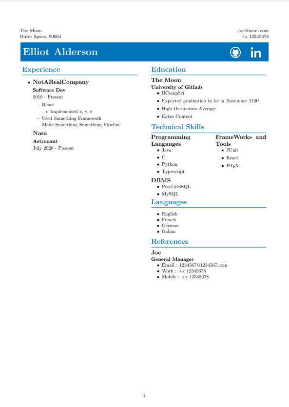

# CV Boilerplate

> I consider LaTeX resumes to be a secret handshake of sorts, something that makes me significantly more likely to be inclined to hire a candidate.  
> &mdash;<cite>[zackelan](https://news.ycombinator.com/item?id=10452606)<cite> on HN

#Forked from https://github.com/mrzool/cv-boilerplate and built my own template using pandoac
#to read from a yaml contents file and dynamically typeset for my CV.

#FYI A handy hack is to updated the default tool of LateX workshop's VS Code extension
#To call the make command on save so that pandoc is run on save.

## Intro - Sample of the template using the CVContentTemplate.yml

#For more information regarding setup / dependencies read:
https://github.com/mrzool/cv-boilerplate/blob/master/README.md

## License

This repository contains a modified version of Dario Taraborelli's [cvtex](https://github.com/dartar/cvtex) template.

License: [CC BY-SA 3.0](http://creativecommons.org/licenses/by-sa/3.0/)
